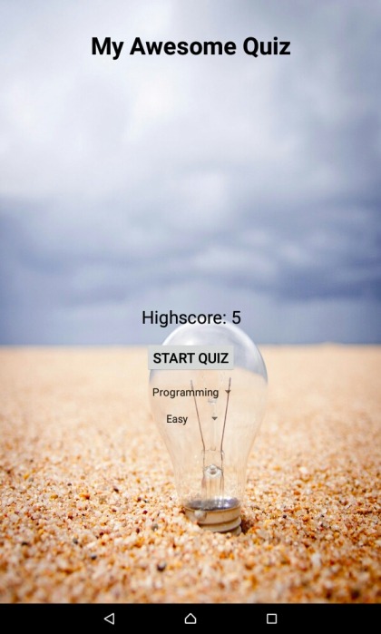
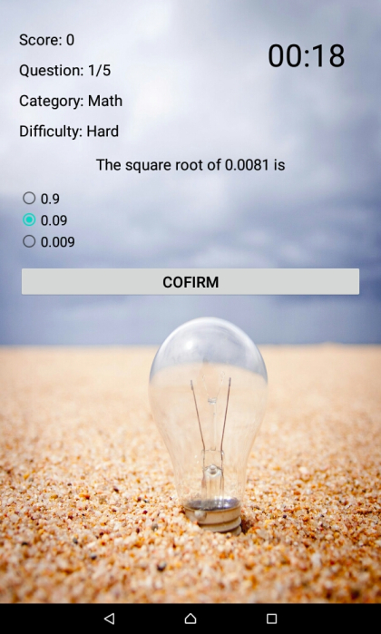

# Awesome Quiz Android Application

 It's a multiple choice quiz app which stores it’s questions in an SQLite database. it will count points for correct answers, save a highscore by SharedPreferences and implement a countdown timer for each question.

It also display the wrong and correct answers after the user made it’s choice or the timer ran out. Each quiz has different Category and Difficulty level.

## Overview
* The application has two Activities.
* Fisrt Activity has a button to navigate to second activity to start quiz.
* there are two Spinner one for category and the other for difficulty.
* Second Activity is for a quiz , shows your current score in the quiz.
* It shows current question number and maximum question numbers for the quiz.
* It shows category and difficulty level for the quiz.

## Technologies
* Java as development programming language.
* Android Studio as development environment.

